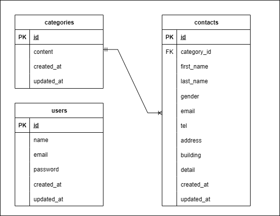

# お問い合わせフォーム

## 環境構築

Dockerビルド

1. git clone リンク
2. docker-compose up -d -build

* MySQLはOSによって起動しない場合があるため、それぞれのPCに合わせてdocker-compose.ymlファイルを編集してください。

Laravel環境構築

1. docker-compose exec php bash
2. composer install
3. .env.exampleファイルを元に.envファイルを作成し、環境変数を変更する
4. php artisan key:generate
5. php artisan migrate
6. php artisan db:seed

## 使用技術

・PHP 8.1.33
・Laravel 8.83.8
・MySQL 15.1

## ER図

* 以下が本システムのER図です。

## URL

・開発環境: http://localhost/
・phpMyAdmin: http://localhost:8080/